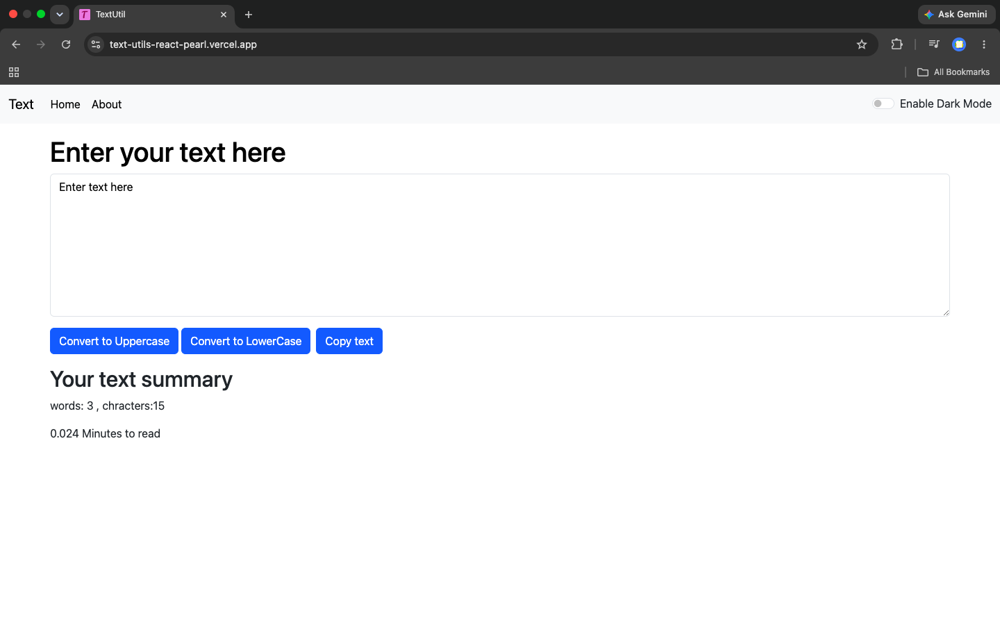
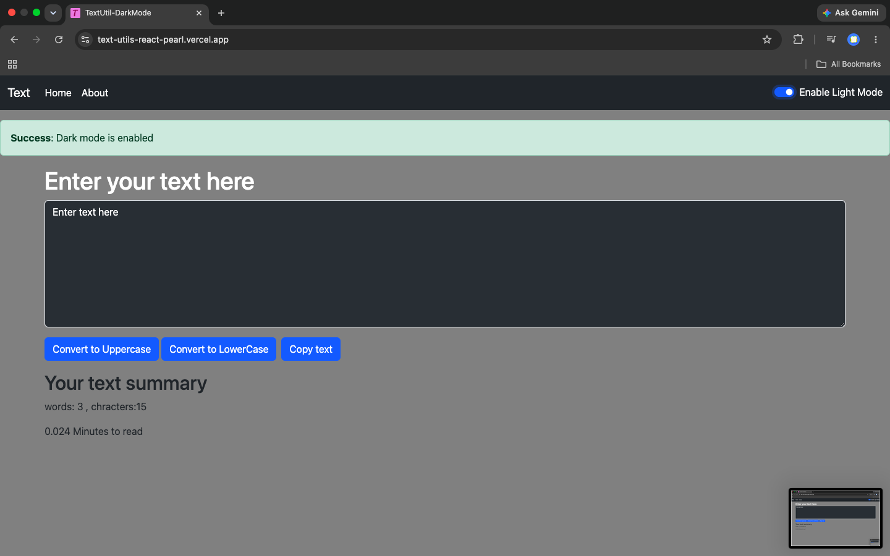
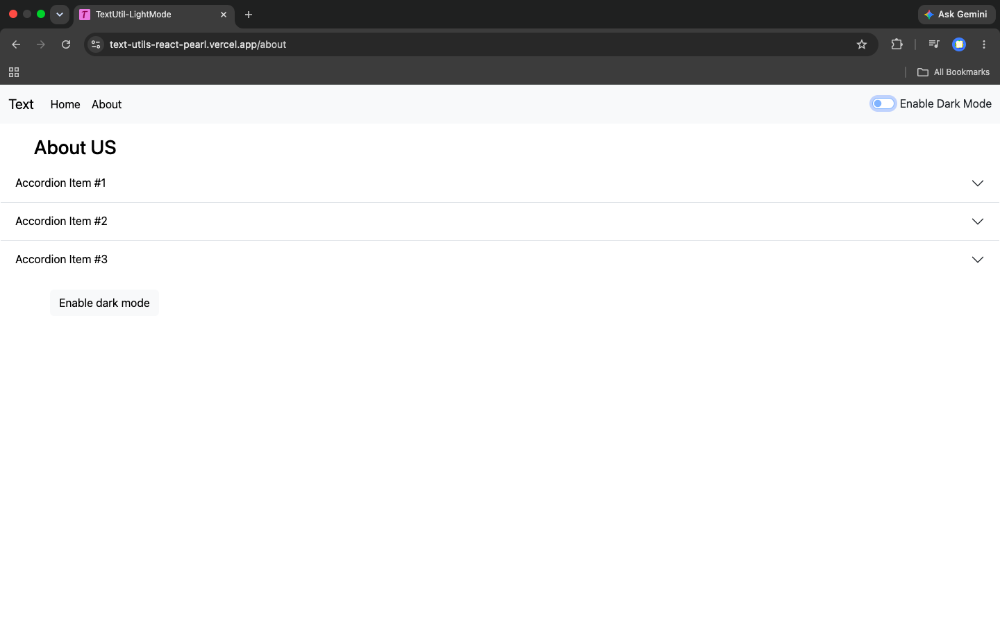

# 🚀 TextUtils

A React application that helps users manipulate and analyze text quickly and efficiently.

## 🌐 Live Demo

👉 https://text-utils-react-pearl.vercel.app

---

## ✨ Features

- 🔠 Convert text to Uppercase
- 🔡 Convert text to Lowercase
- 📋 Copy text
- 🌙 Dark Mode
- 📊 Word Counter
- 🔢 Character Counter
- ⏱️ Reading

## 📸 Screenshots

### Home Page

### Dark Mode

### About Page

## Repository:
https://github.com/aditya101raj/TextUtils-react
